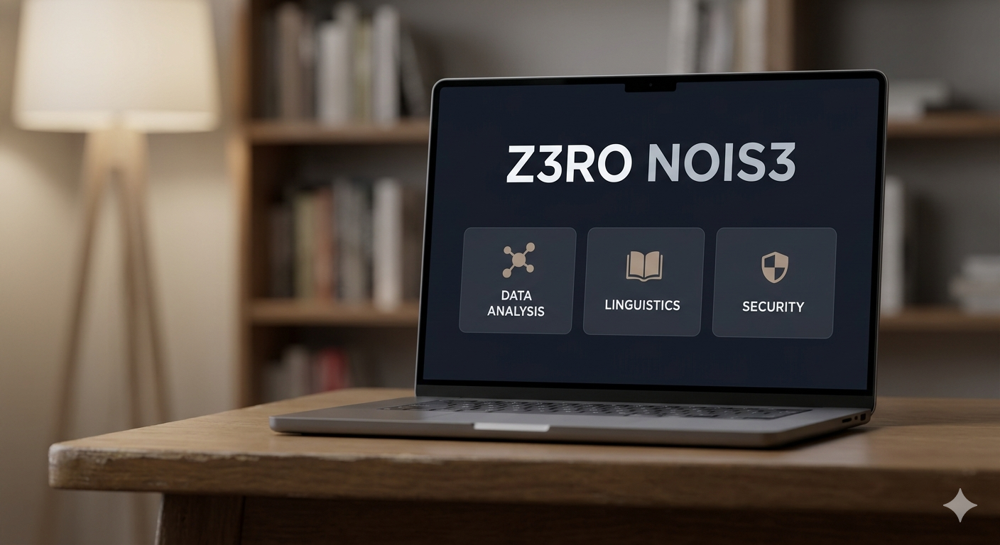

# Z3RO NOIS3



## 🌍 The Mission
**Z3ro Nois3** is a linguistic forensic engine designed to audit the structural and economic exclusion of Bantu languages in modern Large Language Models (LLMs).

This monorepo brings together two projects:

| Module | Description |
| :--- | :--- |
| [`z3r0-nois3/`](z3r0-nois3/) | **The Engine** — CLI & Streamlit tools that audit tokenization costs, linguistic entropy, security search spaces, and morphological forensics. |
| [`shona-rockyou/`](shona-rockyou/) | **The Corpus** — A research-oriented Shona linguistic dataset of names, surnames, totems, place names, and morphological components. Linked as a [git submodule](https://github.com/JustNunuz/Shona-Rockyou). |

## 🚀 Quick Start

### 1. Clone (with submodule data)
```bash
git clone --recurse-submodules https://github.com/JustNunuz/z3r0-Noise.git
cd z3r0-Noise
```

If you already cloned without `--recurse-submodules`:
```bash
git submodule update --init --recursive
```

### 2. Install Dependencies
```bash
pip install -r z3r0-nois3/requirements.txt
```

### 3. Run the Engine
```bash
# CLI analysis
cd z3r0-nois3
python3 shona_corpus_analysis.py Genesis_full.txt

# Streamlit dashboards
streamlit run dashboard.py
streamlit run shona_leet_mutator2.py
```

## 📂 Project Structure

```
z3r0 Nois3/
├── z3r0-nois3/     ← Forensic engine, dashes, and analysis scripts
├── shona-rockyou/  ← The Corpus containing cleaned cultural datasets
└── bridge/         ← Adaptive tokenization modeling and benchmarking
```

Instead of explaining every single file, the architecture is grouped into three main concepts:

* **`z3r0-nois3/`**: Computes the "Bantu Tax" and tests language representations. It houses CLI scripts and Streamlit dashboards used by researchers to analyze linguistic entropy, generate morphological mutations, and map systemic sub-word glitches.
* **`shona-rockyou/`**: Houses the raw, cleaned datasets. This includes curated wordlists of given names, totems, and geography. Also contains generated mutations used to test security strength and search spaces.
* **`bridge/`**: The machine learning and experimental Tokenizer bridge. This folder contains the code that actively learns Shona patterns to build an adaptive, unsupervised tokenizer designed to outperform traditional BPE methods.

## 🔗 How the Modules Work Together

The **Shona-Rockyou** corpus provides the raw linguistic seeds (names, totems, places) that the **z3r0-nois3** engine consumes to:

1. **Audit the "Bantu Tax"** — quantify the cost difference of tokenizing Shona vs English.
2. **Generate Security Mutations** — produce leet-speak password variants and measure entropy delta.
3. **Map Sub-word Glitches** — visualize where AI tokenizers mangle meaningful Shona morphemes.
4. **Benchmark Slot-Based Tokenization** — propose more efficient processing for agglutinative languages.

## 🛡️ Security & DPO Perspective
As a project led by a **Certified Data Protection Officer (DPO)**, Z3ro Nois3 explores how linguistic bias affects data privacy. When an AI doesn't understand the morphology of a language, it cannot properly audit the entropy of its users' data, leading to a "False Security" trap in the SADC region.

## 🤝 Call for Contributors
Help us bridge the linguistic gap! We are expanding our engine to support a wider range of Bantu languages.

* **Language Experts:** Help us map the morphological "slots" for Ndebele, Zulu, Swahili, and more.
* **Data Providers:** We are looking for clean, diverse datasets to improve our forensic audits.
* **Developers:** Help us optimize the Python middleware for regional scale.

*Built with ☕ for the future of African AI.*
